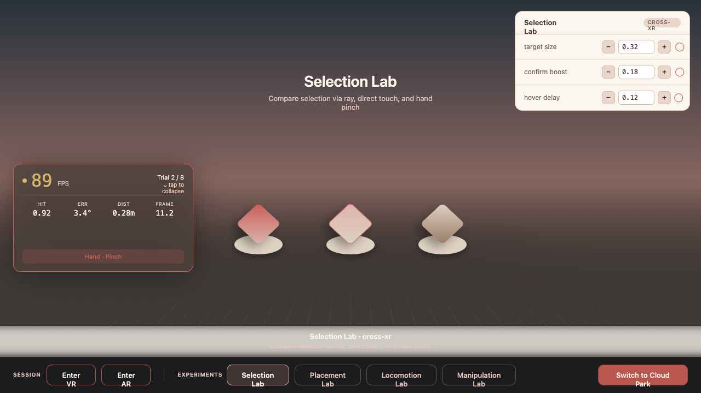
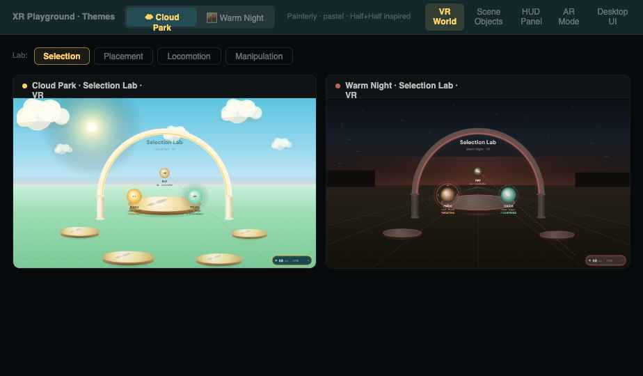
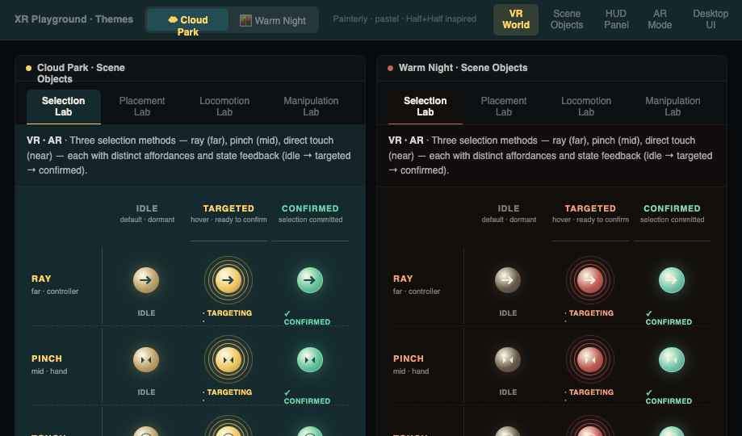
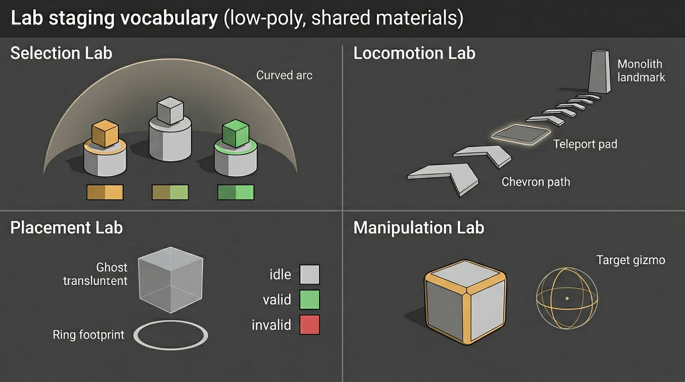

# WebXR Interaction Playground

*A web-native substrate for inventing, remixing, and sharing XR interaction techniques.*

Headset plus URL. That's the install. Each lab isolates one interaction question — select, place, locomote, manipulate — and lets you tune it live and A/B against alternatives.



## What this is

A playground for the durable questions in XR interaction — the ones that matter across Quest, Vision Pro, Galaxy XR, and whatever ships next. WebXR is the substrate because it's the only cross-platform surface where a technique built once can be felt on every device. Platform-specific sensing — Meta's full hand-pose taxonomy, Apple's gaze data, EMG, body tracking — lives behind SDK walls and isn't in scope here. The *interaction grammar* — how a person selects, grabs, places, moves, manipulates — is shared, and that's what this is for.

## Why it exists

XR interaction work happens in silos. Papers ship one-off demos. SDKs ship proprietary patterns. A technique from a CHI paper and a technique from Meta's Interaction SDK can't be felt side by side without a week of integration each. The playground is one place where they can — and where the techniques can be composed, not just compared.

## Commitments

1. **Lowest possible friction.** URL plus headset. No SDK install, no store review, no fork-and-build.
2. **Live, in-headset tuning.** Every interaction parameter — thresholds, timing, sensitivity, feedback intensity — is exposed in a web panel you can reach from inside the headset. Adjust it and feel the change instantly. No code edits, no rebuild, no scene reload, no taking the headset off. Iteration loops collapse from minutes to seconds.
3. **AI as the authoring layer.** The codebase is built for agent-driven authoring as a first-class workflow, not a bolt-on.
4. **Composable primitives.** *(Upcoming.)* Behaviors are the unit, not input sources. A `select` primitive graduates out of its lab and becomes an import for the next lab. Combinatorial composition is where the surprising patterns live.

## Who it's for

Anyone with an opinion about how XR should feel — and now that AI coding agents have collapsed the distance between "I have an idea" and "I can put it in a headset," that includes designers as a first-class audience, not just engineers. Researchers run comparative studies. Designers prototype patterns from papers they just read. Engineers push the primitive layer. The same repo serves all three because the friction floor is low enough that authorship isn't gated by stack fluency.

## The bet

The interaction grammar of spatial computing is being authored right now, in scattered demos on incompatible platforms. If it gets authored in one place — open, web-native, mix-and-match, agent-scaffolded — the field iterates faster on the techniques worth keeping, and the people inventing them get to build on each other's work instead of starting from zero every time.

---

## Try it in 60 seconds

```bash
git clone <this-repo> && cd webxr-playground
npm install
npm run dev
# open the printed URL on desktop (emulator) or on your headset's browser
```

On Quest 3 from macOS, the validated path is `adb reverse` to forward `localhost:5173` into the headset — see `docs/overview.md` for the full device-testing notes.

## A look inside

Each lab is a focused interaction microscope, themed so the same primitive can be felt in different worlds:

| | | |
|---|---|---|
|  |  |  |
| *Same lab, different worlds.* | *One question, many inputs.* | *A vocabulary of labs.* |

- **Same lab, different worlds.** Cloud Park (painterly, daylit) and Warm Night (low-light, contemplative) — themes are swappable so visuals never tangle the interaction study.
- **One question, many inputs.** Ray, pinch, and direct touch each get idle → targeted → confirmed feedback so behaviors are honest to compare.
- **Tune it live, in-headset.** Thresholds, timing, sensitivity, and feedback intensity surface in a panel you can reach inside the headset. Adjust and feel the change instantly — no reload, no rebuild, no headset-off.
- **A vocabulary of labs.** Selection · Locomotion · Placement · Manipulation — shared visual language so participants can move between studies without re-learning.
- **Instrumentation that follows you.** A TagAlong HUD reports FPS, latency, and recent events from inside the headset so sessions are measurable, not just memorable.

## How this project is organized

This project is an XR interaction playground, not a single product app. It's a shell that hosts many small, focused labs:

- the whole app is the playground
- each lab is one design experiment
- reusable interaction pieces live outside the labs so they work across modes
- both controllers and hand tracking are supported from the start
- the architecture is deliberately AI-agent-friendly, so an agent can scaffold a new lab from a paper or sketch

### Stack

- Vite + React + TypeScript
- `@react-three/fiber`, `@react-three/drei`, `@react-three/xr` (v6+)
- `zustand` (app state) + `leva` (runtime tuning)

### Folder structure

Directories are created as needed, not pre-emptively. Entries marked *(planned)* are aspirational landing spots described in the roadmap.

```
docs/                         # overview.md, vision.md, roadmap.md, pitfalls.md
public/assets/                # static models, audio clips
src/
  app/                        # playground shell, zustand store, lab switcher
  config/                     # lab registry, XR defaults, presets
  labs/                       # focused interaction experiments
  ui/                         # desktop overlay controls, debug panel, stats
  xr/
    core/                     # XR store, session config, convenience hooks
    feedback/                 # audio + haptic feedback primitives
    hud/                      # in-XR TagAlong HUD + read-only stats/metrics panel
    interactions/             # (planned) reusable primitives by behavior (select, grab, place, locomote, menu, anchors)
    rigs/                     # (planned) extensions over v6 built-in controller/hand components
    scene/                    # shared scene + mode-specific scene layers
    theme/                    # palette presets, theme provider
    visual/                   # shared visual primitives (holos, shared scenery, skydome)
```

## Adding a lab

When creating a new lab, ask:

- What interaction am I testing?
- Does it work with both controllers and hand tracking?
- Which parts should be reusable in other labs?
- Which parts are specific to the environment?

Then:

1. Add an entry to `src/config/labs.ts` with the lab ID, name, and mode.
2. Create the component file in the appropriate `src/labs/` subdirectory.
3. Add the import to `src/app/LabContent.tsx`.

## Working style

- Keep each lab focused on one interaction question.
- Organize interaction code by behavior (select, grab, place), not by input source (ray, hand, controller).
- Lean on `@react-three/xr` v6 built-ins before building custom systems.
- Use `leva` for runtime parameter tuning, with defaults defined in `src/config/`.
- Test with both controllers and hand tracking before considering a lab done.
- Test in desktop emulation first, then validate on Quest 3 via `adb reverse`.
- Optimize for clarity and iteration speed before visual polish.

## Session log workflow

- Use the in-app Session Logger panel to record test notes while running labs.
- Entries sync to desktop via `/api/logs` and persist in `logs/session-notes.json`.
- Open `http://localhost:5173/logs-viewer.html` to review, filter, and export logs.

## Documentation

| Doc | Role |
|---|---|
| `docs/vision.md` | The long-horizon bet: why this exists, what it grows into, the medium it wants to become. |
| `docs/overview.md` | Stable reference: goals, stack, architecture, directories, conventions, device testing. |
| `docs/roadmap.md` | Phased deliverables and editable near-term focus. |
| `docs/pitfalls.md` | Bugs and footguns we have already hit. |
| `docs/visual-capture.md` | Playwright screenshot workflow for shell and 3D scene review angles. |
