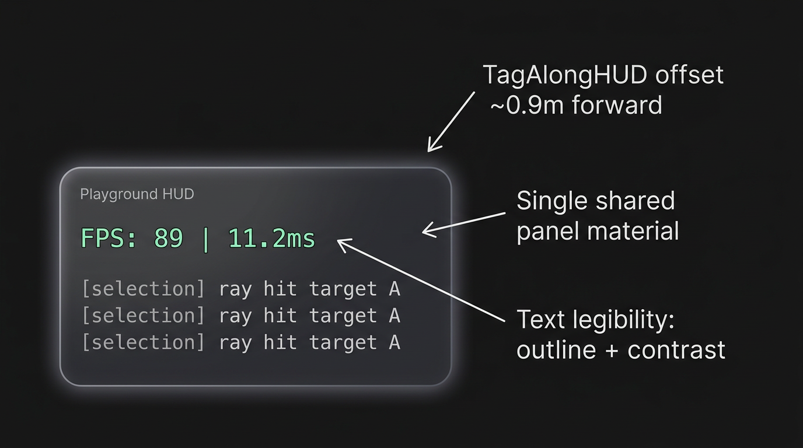

# WebXR Interaction Playground

> **An open, web-based lab for the people inventing how humans will touch, point, grab, and move through spatial computing.**
> Open a URL, put on a headset, and you're in the lab. No SDK installs. No app-store review. No platform lock-in.


## Why this exists

Spatial computing doesn't have a shared interaction vocabulary yet — and the way the field works today keeps it stuck. Every platform ships its own SDK. Every paper at CHI / UIST / ISMAR ships its own one-off demo. Brilliant ideas — DOF separation, gaze-and-pinch, novel selection mappings — can't be compared, combined, or built on without a week of integration each.

**Innovation happens when ideas collide. The field doesn't have a place for the collision yet.**

This playground is built to be that place: a shared, web-native substrate where techniques from different platforms, papers, and input modalities sit side by side, get mixed and matched, and graduate into something the next person can build on.

## What you get

- **A headset and a URL — that's the whole setup.** WebXR means no native build, no SDK, no store review. Same code reaches Quest 2/3/Pro, Vision Pro, Pico, Android XR (Galaxy XR, Xreal), ARCore phones, and whatever ships next.
- **One interaction question per lab.** Selection. Grab. Placement. Locomotion. Manipulation. Each lab isolates a single question so it can be tuned with live controls in front of real participants and A/B'd against alternatives.
- **Mix-and-match across labs.** Snap a graduated primitive from one lab into another and *feel* what _teleport + DOF-separated grab + gaze-confirmed selection_ does together. Combinatorial exploration is where surprising patterns are born.
- **AI is a first-class collaborator.** The repo is structured around an "add a lab in three edits" contract, with `AGENTS.md`, skill files, and editor rules wired up so an agent can scaffold a working lab from a paper PDF or a napkin sketch — and you spend your time on the interaction question, not the plumbing.
- **Controllers and hands from day one.** Code is organized by *behavior* (select, grab, place), not by input source — so each experiment works across rays, pinches, and direct touch.

## Who it's for

Three concentric circles around one promise:

- **Researchers** — implement and evaluate new interaction primitives with real participants, fast.
- **Designers** — prototype patterns from new papers, _feel_ them, remix them, contribute back.
- **Developers** — fork primitives, push the engineering boundary, build the next layer.

The unifying promise: **the lowest technical barrier to build and experiment with XR interaction design — with AI as a co-pilot.** Anyone with an idea about how XR interaction should feel, regardless of how much R3F or WebXR they already know.

## A look inside

Each lab is a focused interaction microscope, themed so the same primitive can be felt in different worlds:

| | |
|---|---|
|  |  |
| **Same lab, different worlds.** Cloud Park (painterly, daylit) and Warm Night (low-light, contemplative) — themes are swappable so visuals never tangle the interaction study. | **One question, many inputs.** Ray, pinch, and direct touch each get idle → targeted → confirmed feedback so behaviors are honest to compare. |
|  |  |
| **A vocabulary of labs.** Selection · Locomotion · Placement · Manipulation — shared visual language so participants can move between studies without re-learning. | **Instrumentation that follows you.** A TagAlong HUD reports FPS, latency, and recent events from inside the headset so sessions are measurable, not just memorable. |

## Try it in 60 seconds

```bash
git clone <this-repo> && cd webxr-playground
npm install
npm run dev
# open the printed URL on desktop (emulator) or on your headset's browser
```

On Quest 3 from macOS, the validated path is `adb reverse` to forward `localhost:5173` into the headset — see [docs/overview.md](docs/overview.md) for the full device-testing notes.

## The vision in one paragraph

Spatial computing is in a formative moment — the kind that GUI design went through decades ago, when the conventions hadn't settled. XR's equivalents — its grab, its select, its menu, its locomotion — are being authored right now, in scattered demos and incompatible platforms. This playground is a bet that if those experiments live in **one open, web-native, mix-and-match environment**, the field converges faster on the interactions that feel truly natural — and the people inventing them get to build on each other's work instead of starting from zero every time. Read the full framing in [docs/vision.md](docs/vision.md).

---

## How this project is organized

This project is an XR interaction *playground*, not a single product app. It's a shell that hosts many small, focused labs:

- the whole app is the playground
- each lab is one design experiment
- each experiment belongs to `VR`, `AR`, or `cross-XR`
- reusable interaction pieces live outside the labs so they work across both modes
- both controllers and hand tracking are supported from the start
- the architecture is deliberately AI-agent-friendly, so an agent can scaffold a new lab from a paper or sketch

## Repository map

| Doc | Role |
|-----|------|
| [docs/vision.md](docs/vision.md) | Long-horizon "why this exists": audience, web/Quest 3 framing, mix-and-match, agentic harness, future modalities. |
| [docs/overview.md](docs/overview.md) | Stable reference: goals, stack, architecture, directories, conventions, device testing. |
| [docs/roadmap.md](docs/roadmap.md) | Phased deliverables and editable near-term focus. |
| [docs/pitfalls.md](docs/pitfalls.md) | Bugs and footguns we have already hit. |
| [docs/visual-capture.md](docs/visual-capture.md) | Playwright screenshot workflow for shell and 3D scene review angles. |
| [docs/project-plan.md](docs/project-plan.md) | Short index of the above (for old bookmarks). |

## Stack

- `Vite` + `React` + `TypeScript`
- `@react-three/fiber`, `@react-three/drei`, `@react-three/xr` (v6+)
- `zustand` (app state) + `leva` (runtime tuning)

## Folder Structure

Directories are created as needed, not pre-emptively. The intended layout:

```text
docs/                         # overview.md, roadmap.md, pitfalls.md, project-plan.md (index)
public/assets/                # static models, audio clips
src/
  app/                        # playground shell, zustand store, lab switcher
  config/                     # lab registry, XR defaults, presets
  labs/
    ar/                       # AR-only experiments
    cross-xr/                 # experiments for both VR and AR
    vr/                       # VR-only experiments
  ui/                         # desktop overlay controls, debug panel, stats
  xr/
    core/                     # XR store, session config, convenience hooks
    feedback/                 # visual, audio, and haptic feedback primitives
    interactions/             # reusable primitives by behavior (select, grab, placement, locomotion, menu, anchors)
    rigs/                     # extensions over v6 built-in controller/hand components
    scene/                    # shared scene + VR/AR-specific scene layers
```

## How To Think About It

When creating a new lab, ask:

- What interaction am I testing?
- Is this experiment for `VR`, `AR`, or both?
- Does it work with both controllers and hand tracking?
- Which parts should be reusable in other labs?
- Which parts are specific to the environment (VR floor, AR surface placement)?

## Adding a Lab

1. Add an entry to `src/config/labs.ts` with the lab ID, name, and mode
2. Create the component file in the appropriate `src/labs/` subdirectory
3. Add the import to `src/app/LabContent.tsx`

## Working Style

- Keep each lab focused on one interaction question.
- Organize interaction code by behavior (select, grab, place), not by input source (ray, hand, controller).
- Lean on `@react-three/xr` v6 built-ins before building custom systems.
- Use leva for runtime parameter tuning, with defaults defined in `src/config/`.
- Test with both controllers and hand tracking before considering a lab done.
- Test in desktop emulation first, then validate on Quest 3 via `adb reverse`.
- Optimize for clarity and iteration speed before visual polish.

## Session Log Workflow

- Use the in-app Session Logger panel to record test notes while running labs.
- Entries sync to desktop via `/api/logs` and persist in `logs/session-notes.json`.
- Open `http://localhost:5173/logs-viewer.html` (or current dev port) to review/filter/export logs from your Mac.

## Documentation

- **Why this exists (vision):** [docs/vision.md](docs/vision.md)
- **Architecture and conventions:** [docs/overview.md](docs/overview.md)
- **What to build next:** [docs/roadmap.md](docs/roadmap.md)
- **Avoid repeat mistakes:** [docs/pitfalls.md](docs/pitfalls.md)
- **Capture visual reviews:** [docs/visual-capture.md](docs/visual-capture.md)
