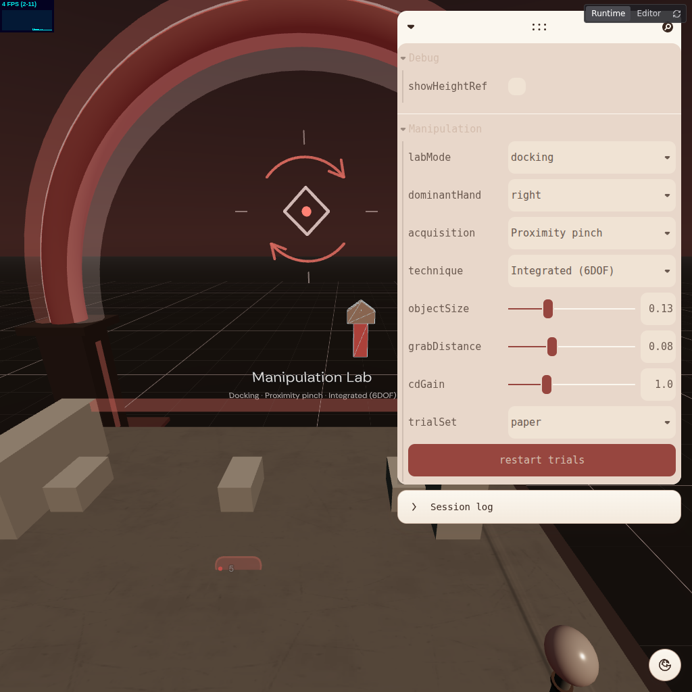
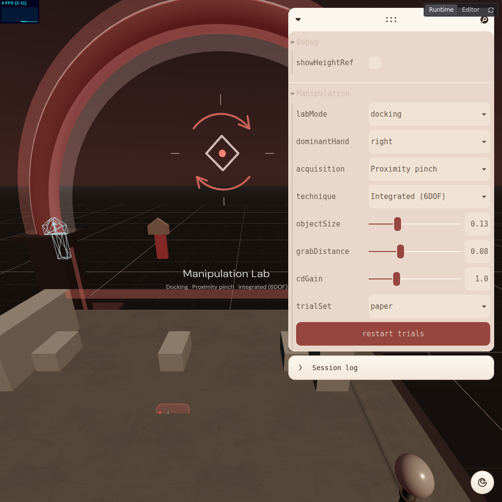

# Agent harness

**Status:** Phase 2 of the [Phase 1/2 execution plan](./phase-1-2-execution-plan.md) — tasks 2.1–2.3 — landed. Dev-only; nothing here ships in a production build.

An agent can move the emulated headset and hands, pinch, pull triggers, screenshot from inside the session, read the console, and — via the shim in `src/dev/agentHarness.tsx` — ask the running app where things actually are. With zero changes to `src/labs/**`.

---

## Quick start

```bash
npm run dev:agent          # Vite + IWER emulation + headless managed browser + MCP relay
node scripts/xr-agent.mjs get_session_status
```

`npm run dev` is unchanged and does **not** load any of this. See [Why opt-in](#why-its-opt-in).

---

## How the pieces fit

```
agent  ──▶  scripts/xr-agent.mjs  ──▶  ws://localhost:5173/__iwer_mcp
                                              │
                                    ┌─────────┴──────────┐
                                    │                    │
                          @iwsdk/vite-plugin-dev    managed Chromium page
                          (screenshots, console)         │
                                                         ├─ IWER device  (xr_* tools)
                                                         └─ window.FRAMEWORK_MCP_RUNTIME
                                                            = src/dev/agentHarness.tsx
```

`@iwsdk/vite-plugin-dev` gives an agent the **device**. It cannot answer "where is the thing I am supposed to grab?", because its scene and ECS tools are written against IWSDK's own runtime. The plugin leaves a documented seam for that: any framework may publish `window.FRAMEWORK_MCP_RUNTIME`, and the injected bridge routes matching methods there before falling back to the IWER device. `src/dev/agentHarness.tsx` is that seam for React Three Fiber.

### Why a script instead of an MCP server entry

The plugin at 0.5.1 exposes the relay but does not generate `.mcp.json` (the `ai.tools` option in older docs no longer exists — `AiOptions` is `{ mode, screenshotSize }`). `scripts/xr-agent.mjs` speaks the relay protocol directly, so the harness is drivable from a shell without registering an MCP server in an editor first. Registering the plugin's MCP server as well is fine; both are clients of the same relay.

Wire format is `{ id, method, params }` → `{ id, result | error }`. `method` is the MCP tool name minus its group prefix for device/browser tools (`xr_set_transform` → `set_transform`), and the tool name verbatim for the ECS-shaped ones (`ecs_step`).

---

## What the shim answers

`handles()` claims only what it can honestly serve; anything else falls through to the plugin's own error path rather than returning a plausible lie.

| Method | Maps onto |
|---|---|
| `get_scene_hierarchy` | Walks the live R3F `Object3D` graph (`parentId`, `maxDepth`) |
| `get_object_transform` | Local + world transform, plus `positionRelativeToXROrigin` |
| `ecs_pause` / `ecs_resume` / `ecs_step` | R3F `frameloop="never"` + `advance()` |
| `ecs_find_entities` | Scene objects + the store pseudo-entities, with world positions |
| `ecs_query_entity` | Object3D transform/visibility, or a store snapshot |
| `ecs_set_component` | Object3D fields, zustand store setters, Leva control paths |
| `ecs_list_components` | The mapping table above, at runtime |

### Pseudo-entities

This app has no ECS. "Entities" 0–3 are the stores it actually steers itself with:

| Index | Name | Writable fields |
|---|---|---|
| 0 | `PlaygroundStore` | `currentLab`, `themePresetId`, `fpsHudVisible`, `arAlignmentGuide` |
| 1 | `LevaControls` | any Leva control path, e.g. `Manipulation.cdGain` |
| 2 | `XRSession` | `mode` → `immersive-vr` \| `immersive-ar` \| `null` |
| 3 | `XRInput` | `handModel`, `controllerModel` |

Indices ≥ 4 are scene objects, assigned lazily and remembered by UUID.

`XRSession.mode` exists because the plugin's `xr_accept_session` can only take whatever mode the page is offering, which for this app resolves to `immersive-ar` — whose emulated passthrough renders black. Setting the mode calls the same `xrStore.enterVR()` / `enterAR()` the shell's buttons do.

### Finding things in a scene with no names

Almost nothing here sets `Object3D.name` — R3F scenes are described by JSX structure. So `namePattern` matches against an **identity** string: the name when there is one, otherwise `Type/GeometryType`. Results carry a geometry/material summary and a world position, which is usually the whole reason you were looking.

```bash
node scripts/xr-agent.mjs ecs_find_entities '{"namePattern":"ExtrudeGeometry"}'
# → the docking key (MeshStandardMaterial) and its ghost target (wireframe)
```

Giving labs real `name` props would be better than pattern-matching on geometry. That is a `src/labs/**` change and so out of scope for this phase.

---

## Acceptance run: grab-move-release

Driven end to end over the bridge, from a freshly loaded page, with no spec-file edits.

| | |
|---|---|
|  | **1 — before.** Solid key at its origin (left); wireframe ghost marks the dock target 30 cm to the +X side. |
|  | **2 — carried.** Pinch closed on the key, hand interpolated to the dock over 14 steps. The key now occupies the ghost's position; its origin is empty. |
|  | **3 — released.** Pinch opened; the lab recorded the trial and advanced. |

The sequence, abbreviated:

```js
// lab first — it takes over hand config on mount, so the model override must land after it
ecs_set_component { entityIndex: 0, componentId: 'PlaygroundStore', field: 'currentLab',   value: 'manipulation' }
ecs_set_component { entityIndex: 3, componentId: 'XRInput',         field: 'handModel',    value: false }
ecs_set_component { entityIndex: 2, componentId: 'XRSession',       field: 'mode',         value: 'immersive-vr' }
set_input_mode    { mode: 'hand' }

ecs_find_entities   { namePattern: 'ExtrudeGeometry' }      // locate key + ghost by geometry
get_object_transform{ uuid: <key group> }                   // → world position

set_transform     { device: 'hand-right', position: keyPos }
set_select_value  { device: 'hand-right', value: 1 }        // pinch down → acquire
set_transform     { device: 'hand-right', position: … }     // × 14, interpolated to the dock
set_select_value  { device: 'hand-right', value: 0 }        // pinch open → release
screenshot        {}
```

Verified from the lab's own state rather than from the screenshot alone: `PlaygroundStore.hudReport` reported `POS 6.5cm · ROT 39.5°`, the trial counter advanced 1 → 2 of 30, and `logEntryCount` went 0 → 1.

---

## Known characteristics

**Release pose picks up the pinch-open animation.** The object tracks the thumb every frame, and `useManipulation` applies one more manipulation step on the same frame it observes `selectend`. IWER animates the pinch open over several frames, so a release driven by `set_select_value: 0` lands a few centimetres and tens of degrees off where the object sat while held — reproducibly ~6.5 cm / 39.5° in the run above, even though the carry itself is exact to 1e-8. A human pinch has the same physics; this is not an artifact of the harness. It does mean **the harness cannot currently drive a snapped docking trial**, and any driven test should assert on the carry, not on the recorded release offset.

**Pausing stops rendering, not just simulation.** The upstream tool descriptions promise that `ecs_pause` halts systems while the render loop continues. There is no system layer here — the R3F frameloop *is* the tick — so pausing stops rendering too. Screenshots still work; they just stop changing.

**The lab owns hand config while mounted.** `ObjectManipulationLab` calls `xrStore.setHand(...)` on mount and whenever `acquisition` changes, which resets `model: true`. Set `XRInput.handModel` *after* switching labs, or it will be clobbered.

**Hand/controller models are fetched from a CDN.** `@webxr-input-profiles/assets` is loaded from `cdn.jsdelivr.net` at session start. On a machine without egress to it the load rejects, and because nothing wraps the XR subtree in an error boundary the rejection takes down the whole R3F canvas and loses the WebGL context. `XRInput.handModel: false` is the workaround; an error boundary around the canvas, or locally-served profile assets, would be the fix. Both touch XR core rather than the harness, so they are left for a follow-up.

---

## Why it's opt-in

The plugin loads only under `vite --mode agent`, never in `npm run dev` and never in `vite build`:

1. `iwsdkDev` launches a managed Playwright browser and an MCP server the moment the dev server boots. `npm run dev` is also what `playwright.config.ts` starts as its `webServer`, so an always-on plugin would spawn a second browser and a relay on every `capture:screenshots` / `test:visual` run.
2. Outside its own managed page the plugin installs the IWER DevUI overlay, which would land in the capture suite's frames.
3. It makes "absent from the production bundle" structural rather than incidental.

`--mode` rather than an env var so the flag behaves the same on Windows, and so client code can branch on the statically-known `import.meta.env.MODE`.

### Vite 8

`@iwsdk/vite-plugin-dev@0.5.1` peer-declares `vite ^7.0.0`; this repo is on `^8.0.2`. That is a **declaration** mismatch only — the plugin boots, injects, relays, and screenshots correctly on Vite 8.0.8. `package.json` carries an `overrides` entry pinning the plugin's `vite` peer to the root version so `npm install` resolves without `--legacy-peer-deps`. Revisit when the plugin widens its peer range.

### Emulation ownership

`@react-three/xr` installs its own IWER device on `localhost` when WebXR is unsupported. Under `--mode agent` the plugin has already installed one from an injected `<head>` script. r3xr's injector does back off on its own (it probes `isSessionSupported` first), but that probe is async. `src/xr/core/xrStore.ts` sets `emulate: false` in agent mode to make the handoff explicit; plain `npm run dev` is untouched.

### The DevUI-hiding hack in `App.tsx`

Re-evaluated as task 2.2 asks, and kept. It now has two possible owners — r3xr under `npm run dev`, the plugin under `dev:agent` — and the plugin suppresses its DevUI *only* on its own managed page (`window.__IWER_MCP_MANAGED`). A human pointed at the agent dev server still gets the badge. Both render the same `@iwer/devui` host, so the existing content-based detection covers both unchanged.
