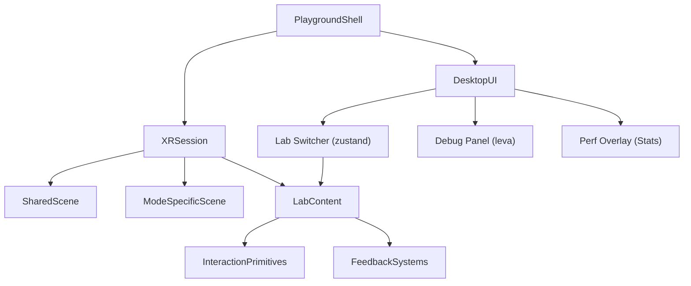

# Overview

## Purpose of this document

**Overview** is the stable reference for *what this project is* and *how it is shaped*: goals, product intent, stack and XR patterns, architecture, directory map, state conventions, agent rules, device testing, logging, and working principles. It changes when architecture or conventions change—not every sprint.

**Related docs:** [Roadmap](./roadmap.md) (phases and what to build next), [Pitfalls](./pitfalls.md) (bugs and footguns we already hit), [Visual capture workflow](./visual-capture.md) (Playwright screenshots and 3D review angles), [Spatial polish plan](./spatial-polish-plan.md) and [style templates](./style-templates/README.md) (2D shell vs 3D XR specs), [README](../README.md) (quick start and repo entry).

---

## Goal

Build a cross-XR interaction-design playground that supports fast iteration in Cursor and reliable validation on Meta Quest 3 from macOS in both VR and AR.

The project should help answer questions like:

- Which interaction patterns feel most natural on Quest 3?
- How do controller and hand-tracking variants compare?
- Which ideas work differently in VR versus AR?
- Which interaction patterns should be shared across both modes?
- What feedback, sizing, and comfort settings improve usability?
- Which patterns are worth promoting into reusable building blocks?

## Product Direction

This codebase is not a single immersive app yet. It is a structured prototype playground made of small, isolated labs that can be explored independently.

The playground is the product at this stage. Its purpose is to let us compare interaction patterns quickly, keep shared XR infrastructure in one place, and promote successful ideas into reusable primitives.

Each lab should:

- focus on one interaction problem
- expose key tunable parameters
- include clear visual, audio, or haptic feedback
- support quick switching between input modes when possible
- be simple enough to evaluate in one short test session

## Plain-Language Model

This project should be easy to think about as a designer:

- the app is the playground
- the labs are the experiments
- the XR core is the mode switcher that lets experiments run in VR or AR
- the interaction folders hold reusable building blocks like selection, placement, and menus
- the scene folders hold the environment-specific pieces, such as a VR floor or AR placement reticle

This means we are not making a VR project and then adding AR later. We are making one playground that can host both.

## Playground Definition

The playground consists of:

- a shared app shell for switching between experiments
- a common XR root and scene scaffold
- a mode layer that can enter VR or AR and expose device capabilities
- reusable interaction primitives
- a debug and tuning surface for rapid comparison
- a library of focused labs that test one interaction question at a time in `VR`, `AR`, or `cross-XR`

In other words, the playground is the top-level experience, and the labs are the modules inside it.

## Technical Direction

Default stack:

- `Vite`
- `React`
- `TypeScript`
- `three`
- `@react-three/fiber`
- `@react-three/drei`
- `@react-three/xr` (v6+, backed by `pmndrs/xr`)
- `zustand`
- `leva`

### Key `@react-three/xr` v6 patterns

Session management is store-based. `createXRStore()` returns a store with `enterVR()` and `enterAR()` methods. The `<XR store={store}>` component wraps the scene. This aligns naturally with zustand — the XR store is effectively a zustand store.

Input is unified through pointer events. Both controllers and hands produce standard R3F pointer events on meshes (`onPointerEnter`, `onPointerDown`, `onPointerUp`, `onClick`). Labs respond to pointer events without knowing whether input came from a controller ray, a hand pinch, or a direct poke. This means interaction primitives should be organized by behavior (selectable, grabbable, pokeable) rather than by input source (ray, hand, controller).

Hand tracking works out of the box. Request `hand-tracking` as a session feature and v6 provides `XRHand` components and input states. Both controllers and hands should be enabled from Phase 1.

Teleportation is built-in. `<TeleportTarget>` handles the common case. Custom locomotion systems extend the built-in rather than replacing it.

### Pointer types describe interaction mechanism, not input device

`pointerEventsType` filters by *how* the user interacted, not *what device* they used. The available pointer types are:

- `ray` — distance pointing. Both controllers AND hands use this when aiming from afar. A hand pinch-at-distance is a `ray` event, not a `grab` event.
- `touch` — direct physical contact. A finger physically poking an object surface.
- `grab` — near-field grab. A hand physically closing around an object at close range.

This means `pointerEventsType={{ allow: 'ray' }}` accepts input from both controllers and hands. To separate controller input from hand input, check the event's input source — do not filter by pointer type.

Use `pointerEventsType` when comparing interaction *mechanisms* (e.g., SelectionLab testing ray vs touch vs grab). Do not use it to separate *devices* (e.g., trying to make something "controller-only" or "hand-only").

### Lab routing

Labs use state-based routing, not URL routing. A zustand value like `currentLab: 'selection'` determines which lab content renders inside the XR scene. Switching labs is a state change — the XR session, player rig, and scene scaffolding stay mounted, only the lab-specific content swaps. This avoids XR session disruption on navigation.

```tsx
// Labs render inside a persistent XR tree
<XR store={xrStore}>
  <XROrigin />
  <SharedScene />
  <ModeSpecificScene />
  <LabContent />  {/* swaps based on zustand state */}
</XR>
```

### Runtime workflow

1. Develop locally with fast desktop iteration.
2. Use XR emulation for rapid interaction tuning.
3. Validate frequently on Quest 3 over USB (see Device Testing Workflow).
4. Use remote browser inspection for debugging device-only issues.

## Architecture



The XR session stays mounted at all times. Lab switching happens through zustand state — only the lab content swaps, the session and scene scaffolding persist. Desktop UI (debug panel, lab switcher, performance overlay) lives outside the Canvas as HTML overlays.

## Directory Roles

Directories should be created as needed, not pre-emptively. The structure below describes the intended role of each area. Start with the directories needed for Phase 1 and let the rest emerge.

### `src/app/`

Playground shell and shared state.

- provider composition and Canvas setup
- XR store creation and session entry
- lab switching via zustand
- future session persistence or presets

Phase 1 files:

- `src/app/App.tsx` — Canvas, XR provider, desktop UI composition
- `src/app/store.ts` — playground zustand store (current lab, current mode)
- `src/app/LabContent.tsx` — switch statement mapping lab IDs to components

### `src/config/`

Central configuration. All lab metadata, XR defaults, and tuning presets live here so agents and contributors can discover the full set of options from one place.

- lab registry with IDs, labels, mode support, and component references
- default XR session features and tuning values
- interaction constants and comfort presets

Phase 1 files:

- `src/config/labs.ts` — lab registry (adding a lab = adding an entry here + creating the component)
- `src/config/xr-defaults.ts` — default session features, reference space, hand-tracking flag

### `src/labs/`

Isolated experiments inside the playground. Each file or folder represents one interaction design question.

Organization:

- `src/labs/vr/` — VR-only experiments
- `src/labs/ar/` — AR-only experiments
- `src/labs/cross-xr/` — experiments that should be compared across both modes

Recommended first labs:

- `src/labs/cross-xr/SelectionLab.tsx`
- `src/labs/ar/PlacementLab.tsx`
- `src/labs/vr/LocomotionLab.tsx`

Later labs:

- `src/labs/cross-xr/MenuLab.tsx`
- `src/labs/cross-xr/ObjectManipulationLab.tsx`
- `src/labs/ar/UIReadabilityLab.tsx`

### `src/ui/`

Desktop HTML overlay interface for driving playground testing from outside the headset.

- lab switcher buttons
- VR/AR entry buttons
- debug panel (leva)
- performance stats overlay
- active input source indicator

Phase 1 files:

- `src/ui/DebugPanel.tsx` — leva control wrapper
- `src/ui/PlaygroundControls.tsx` — lab switcher + mode entry buttons
- `src/ui/InputIndicator.tsx` — shows active input source (controller/hand/none)

### `src/xr/core/`

Thin wrappers around `@react-three/xr` v6.

v6 already provides session management, capability detection, and XR providers. This directory holds project-specific configuration and convenience hooks rather than reimplementing the library.

- XR store factory with project-specific session features (hand-tracking, hit-test, etc.)
- shared XR root component
- mode-aware hooks (e.g., `useIsAR()`, `useActiveInputSources()`)

Phase 1 files:

- `src/xr/core/xrStore.ts` — `createXRStore()` with default session config
- `src/xr/core/XRRoot.tsx` — `<XR>` + `<XROrigin>` + scene + `TagAlongHUD` (in-headset stats + logger)
- `src/xr/core/hooks.ts` — convenience hooks for mode and input state

### `src/xr/scene/`

Shared spatial scaffolding used by multiple labs, plus mode-specific environment layers.

- `src/xr/scene/SharedScene.tsx` — lighting, reference grid, ambient setup
- `src/xr/scene/VRScene.tsx` — floor plane, room bounds, environment map
- `src/xr/scene/ARScene.tsx` — passthrough-safe helpers, placement surfaces

Create subdirectories only when a scene area grows beyond a single file.

### `src/xr/rigs/`

Extensions over v6's built-in `<XRController>` and `<XRHand>`. v6 handles the core input abstraction — this directory is for project-specific visual overrides, custom hand gesture detection, or shared spectator/debug camera setups.

Not needed in Phase 1. Create when custom rig behavior is required.

### `src/xr/interactions/`

Reusable interaction primitives organized by behavior, not by input source. v6's pointer event system handles the input routing — these primitives define what objects *do* when interacted with.

- `select/` — making things selectable and targetable, hover/confirm behavior
- `grab/` — making things grabbable, near and far, release and throw tuning
- `placement/` — placing objects on surfaces, snapping, preview ghosts
- `locomotion/` — teleport targets, smooth movement, snap and smooth turning
- `menu/` — world-space panels, wrist-anchored menus, body-relative UI
- `anchors/` — world-locking content, persistent spatial positions

Create each subdirectory when its first primitive is needed. Do not pre-create empty directories.

### `src/xr/feedback/`

Feedback systems that can be composed into any lab:

- `visual/` — hover highlights, outlines, placement previews, state indicators
- `audio/` — confirmation tones, state-change cues
- `haptics/` — controller vibration helpers, intensity presets

### `src/xr/hud/`

World-space UI that must be visible **inside** an immersive session. The Meta Quest browser does **not** implement WebXR DOM overlay for headset AR/VR the way handheld browsers do, so HTML panels (Leva, desktop session logger) do not appear in-headset. This folder holds a small 3D HUD instead:

- `TagAlongHUD.tsx` — smooth-follow group (lags the headset slightly to avoid rigid head-lock)
- `InXRStats.tsx` — minimal rolling-average FPS as drei `<Text>` (drei `<Stats>` is DOM-based and stays invisible in XR)
- `HUDButton.tsx` — simple plane buttons with pointer + haptic/tone feedback

Shared HTTP helpers for desktop persistence live in `src/ui/sessionLogSync.ts` and are used by the desktop Session Logger panel.

### `public/assets/`

Static assets used by labs. Keep prototype-friendly — avoid large asset dumps early.

- `models/` — lightweight GLB props
- `audio/` — feedback sound clips

## State Management Conventions

Three systems, each with a clear job:

### `src/config/` — defaults and presets

Static values that define starting points. Lab registry entries, default XR session features, interaction constants, comfort preset objects. These are plain TypeScript objects and types. They are the source of truth for "what are the options" and "what are the defaults."

### Zustand — app state

Structural state that determines what the playground is doing: current lab, current XR mode, active input sources, session status. Changes here cause the playground to reconfigure (e.g., switching labs, entering AR). The playground store lives in `src/app/store.ts`.

### Leva — runtime tuning

Ephemeral debug controls for parameters you tweak while testing: selection radius, hover delay, haptic intensity, grab threshold, movement speed. Leva controls are defined inside each lab or interaction primitive using `useControls()`. Default values come from `src/config/`.

When cross-lab A/B presets land (Phase 5), they work by loading a config object into Leva's initial values — not by duplicating state into zustand.

Desktop ergonomics:

- `src/ui/DebugPanel.tsx` widens the pane, rows, and fonts so controls are easier to read and hit on a monitor.
- Most numeric lab parameters use the custom `stepperNumber` plugin in `src/ui/levaPlugins/stepperNumber.tsx`: **−** / **+** buttons, a number field, and a **range** slider. **Selection Lab** uses plain Leva number sliders only (avoids fragile size values for the targets).

Leva stays a **desktop** overlay (HTML). It is not replicated inside the headset; see **In-headset HUD** under Device Testing Workflow for VR/AR FPS feedback.

## AI-Agent Conventions

The project is developed with AI coding agents as primary collaborators. The following conventions ensure agents can navigate, modify, and extend the codebase reliably.

### File conventions

- One component per file, filename matches the default export (`SelectionLab.tsx` exports `SelectionLab`)
- PascalCase for components (`SelectionLab.tsx`), camelCase for hooks and utilities (`useXRMode.ts`, `xrStore.ts`), kebab-case for config (`xr-defaults.ts`)
- Barrel exports (`index.ts`) for directories that other parts of the project import from (e.g., `src/xr/interactions/select/index.ts`)

### Lab conventions

- Every lab is registered in `src/config/labs.ts` with its ID, display name, mode (`vr`, `ar`, or `cross-xr`), and lazy component reference
- Adding a lab = adding a config entry + creating the component file + adding the import in `LabContent.tsx`
- Labs receive no props — they read shared state from hooks and configure their own leva controls

### Type conventions

- Shared interfaces and types live next to the code that defines them, not in a central `types/` folder
- Lab config types live in `src/config/labs.ts`
- XR-related types live in `src/xr/core/`
- Prefer explicit types over `any` — agents follow types to understand contracts

### Naming conventions

- No magic strings — use typed constants for mode names (`'vr' | 'ar'`), lab IDs, capability flags
- Zustand selectors use the `(s) => s.field` pattern
- Hooks that wrap zustand state start with `use` (`useCurrentLab`, `useIsAR`)

### Documentation conventions

- **[Overview](./overview.md)** — stable architecture and conventions (this document)
- **[Roadmap](./roadmap.md)** — phases and near-term build priorities
- **[Spatial polish plan](./spatial-polish-plan.md)** — visual direction and configurable theming plan
- **[Style templates](./style-templates/README.md)** — implementable specs: [Shell 2D](./style-templates/shell-2d.md), [XR 3D](./style-templates/xr-3d.md)
- **[Pitfalls](./pitfalls.md)** — mistakes to avoid; read before risky changes (Leva plugins, R3F layout, etc.)
- **[README](../README.md)** — repo entry and quick start
- **[project-plan.md](./project-plan.md)** — index of the above (for old links)
- Code comments explain non-obvious intent and tradeoffs, not what the code does
- Each new directory should get a brief note in **Overview** (Directory Roles) when its role is established

## Device Testing Workflow

### Prerequisites

Install Android platform tools on macOS:

```sh
brew install android-platform-tools
```

Enable Developer Mode on Quest 3:

1. Open the Meta Quest app on your phone
2. Go to Settings → Developer Mode → enable
3. Put on the headset and accept the USB debugging prompt when it appears

### USB connection

Connect Quest 3 to your Mac via USB-C. Verify the connection:

```sh
adb devices
```

You should see your device listed. If it shows "unauthorized," put on the headset and accept the debugging prompt.

### Accessing the dev server

Start the dev server on your Mac (`npm run dev`). Vite is pinned to port **5173** in `vite.config.ts`; if you change the port, update the `adb reverse` line below to match.

The simplest approach on Quest is to forward the headset’s localhost to your Mac’s dev server. This avoids SSL certificate issues because `http://localhost` counts as a secure context (required for WebXR):

```sh
adb reverse tcp:5173 tcp:5173
```

This maps the Quest’s `localhost:5173` to your Mac’s `localhost:5173`. Open the Quest browser and go to `http://localhost:5173` (or `http://127.0.0.1:5173`).

Run the reverse each time you reconnect the USB cable. The repo already wraps it in npm:

```sh
npm run quest
```

(`package.json` → `"quest": "adb reverse tcp:5173 tcp:5173 && …"`.)

### Remote debugging

To inspect the Quest browser from your Mac:

1. Open Chrome on your Mac
2. Navigate to `chrome://inspect/#devices`
3. Your Quest browser tabs should appear under "Remote Target"
4. Click "inspect" to open DevTools for the Quest browser tab

This gives you console logs, network inspection, and DOM access for the headset session.

### Testing checklist

When validating on Quest 3:

- Verify VR entry and AR entry both work
- Test with controllers first (more reliable), then switch to hand tracking
- Watch for frame drops during interactions (drei `<Stats>` on desktop; in-headset FPS card from `InXRStats` when in VR/AR)
- Check that hand tracking recovers gracefully when hands leave the tracking volume
- Confirm haptic feedback fires on controller interactions
- Verify AR hit-test places objects on real surfaces

### In-headset HUD (VR and AR)

While immersed, use the floating panel in the lower-left field of view for a minimal FPS readout. Its status bar uses Quest/WebXR comfort bands: green at **90+ FPS** (smooth), yellow at **72–89 FPS** (not so smooth but acceptable), orange at **45–71 FPS** (choppy), and red below **45 FPS** (not workable). Session notes stay on the desktop logger.

### Desktop log capture and viewer

For evaluation sessions, log entries are persisted on the development machine (macOS) through a local Vite middleware API:

- `POST /api/logs` appends one entry or writes a full entry array
- `GET /api/logs` reads current persisted entries
- `DELETE /api/logs` clears persisted entries

Persisted file location:

- `logs/session-notes.json` (in the project root; ignored by git)

This works from Quest because the app runs through the Mac dev server (`adb reverse` forwards headset requests back to localhost).

To review logs on desktop:

1. Open `http://localhost:5173/logs-viewer.html` (or current dev port)
2. Click `Refresh` to fetch latest entries from `/api/logs`
3. Use `Download JSON` to save a local snapshot

The in-app Session Logger panel (desktop HTML, lower-right) provides:

- input source and **Quick Note** fields for detailed entries
- **Log** — append entry to zustand and POST to `/api/logs`
- **Sync to Desktop** — POST the full in-memory entry list
- entry count, sync status, and persisted file path

Use `logs-viewer.html` in the browser (same origin as the dev server) to review entries; it is not a button on the logger panel.

## Working Principles

- Build for comparison, not completeness.
- Prefer small and testable components over large scenes.
- Keep scene visuals minimal until interaction quality is proven.
- Make important parameters tunable via leva, with defaults in config.
- Separate reusable interaction logic from environment-specific scene setup.
- Organize interaction code by behavior (select, grab, place), not by input source (ray, hand, controller).
- Validate all promising interactions on the physical headset.
- Keep Quest 3 performance constraints in mind — watch frame budgets, avoid unnecessary draw calls.
- Test every lab with both controllers and hand tracking before considering it done.
- Handle "input lost" gracefully — hand tracking drops when hands leave the camera volume.
- Treat AR readability and placement as first-class design problems, not later polish.
- Let the directory structure emerge from need — do not pre-create empty directories.
- Lean on `@react-three/xr` v6 built-ins before building custom systems.

## Success Criteria

We are on the right track when:

- switching between labs is fast and does not interrupt the XR session
- the playground feels like a reusable testing environment rather than a one-off demo
- switching between VR and AR does not require restructuring the codebase
- both controllers and hand tracking work in every lab without special-casing
- shared scene infrastructure is reused cleanly across labs
- interaction code is grouped by behavior rather than by input source or scene
- parameters can be tuned in leva without rewriting components
- frame rate stays stable during interactions on Quest 3
- an AI agent can add a new lab by editing three files (config entry + component + LabContent import)
