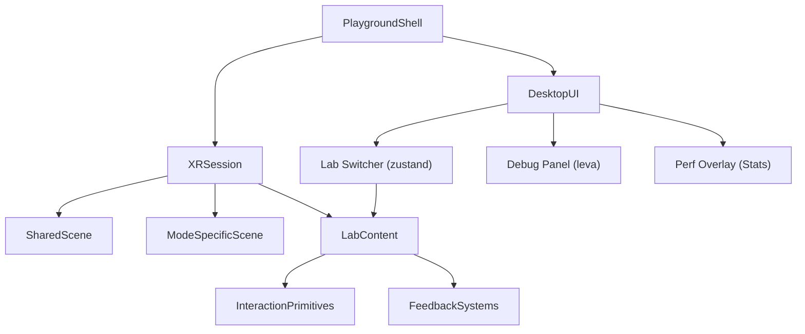

# Project Plan

## Goal

Build a cross-XR interaction-design playground that supports fast iteration in Cursor and reliable validation on Meta Quest 3 from macOS in both VR and AR.

The project should help answer questions like:

- Which interaction patterns feel most natural on Quest 3?
- How do controller and hand-tracking variants compare?
- Which ideas work differently in VR versus AR?
- Which interaction patterns should be shared across both modes?
- What feedback, sizing, and comfort settings improve usability?
- Which patterns are worth promoting into reusable building blocks?

## Product Direction

This codebase is not a single immersive app yet. It is a structured prototype playground made of small, isolated labs that can be explored independently.

The playground is the product at this stage. Its purpose is to let us compare interaction patterns quickly, keep shared XR infrastructure in one place, and promote successful ideas into reusable primitives.

Each lab should:

- focus on one interaction problem
- expose key tunable parameters
- include clear visual, audio, or haptic feedback
- support quick switching between input modes when possible
- be simple enough to evaluate in one short test session

## Plain-Language Model

This project should be easy to think about as a designer:

- the app is the playground
- the labs are the experiments
- the XR core is the mode switcher that lets experiments run in VR or AR
- the interaction folders hold reusable building blocks like selection, placement, and menus
- the scene folders hold the environment-specific pieces, such as a VR floor or AR placement reticle

This means we are not making a VR project and then adding AR later. We are making one playground that can host both.

## Playground Definition

The playground consists of:

- a shared app shell for switching between experiments
- a common XR root and scene scaffold
- a mode layer that can enter VR or AR and expose device capabilities
- reusable interaction primitives
- a debug and tuning surface for rapid comparison
- a library of focused labs that test one interaction question at a time in `VR`, `AR`, or `cross-XR`

In other words, the playground is the top-level experience, and the labs are the modules inside it.

## Technical Direction

Default stack:

- `Vite`
- `React`
- `TypeScript`
- `three`
- `@react-three/fiber`
- `@react-three/drei`
- `@react-three/xr` (v6+, backed by `pmndrs/xr`)
- `zustand`
- `leva`

### Key `@react-three/xr` v6 patterns

Session management is store-based. `createXRStore()` returns a store with `enterVR()` and `enterAR()` methods. The `<XR store={store}>` component wraps the scene. This aligns naturally with zustand — the XR store is effectively a zustand store.

Input is unified through pointer events. Both controllers and hands produce standard R3F pointer events on meshes (`onPointerEnter`, `onPointerDown`, `onPointerUp`, `onClick`). Labs respond to pointer events without knowing whether input came from a controller ray, a hand pinch, or a direct poke. This means interaction primitives should be organized by behavior (selectable, grabbable, pokeable) rather than by input source (ray, hand, controller).

Hand tracking works out of the box. Request `hand-tracking` as a session feature and v6 provides `XRHand` components and input states. Both controllers and hands should be enabled from Phase 1.

Teleportation is built-in. `<TeleportTarget>` handles the common case. Custom locomotion systems extend the built-in rather than replacing it.

### Lab routing

Labs use state-based routing, not URL routing. A zustand value like `currentLab: 'selection'` determines which lab content renders inside the XR scene. Switching labs is a state change — the XR session, player rig, and scene scaffolding stay mounted, only the lab-specific content swaps. This avoids XR session disruption on navigation.

```tsx
// Labs render inside a persistent XR tree
<XR store={xrStore}>
  <XROrigin />
  <SharedScene />
  <ModeSpecificScene />
  <LabContent />  {/* swaps based on zustand state */}
</XR>
```

### Runtime workflow

1. Develop locally with fast desktop iteration.
2. Use XR emulation for rapid interaction tuning.
3. Validate frequently on Quest 3 over USB (see Device Testing Workflow).
4. Use remote browser inspection for debugging device-only issues.

## Architecture



The XR session stays mounted at all times. Lab switching happens through zustand state — only the lab content swaps, the session and scene scaffolding persist. Desktop UI (debug panel, lab switcher, performance overlay) lives outside the Canvas as HTML overlays.

## Directory Roles

Directories should be created as needed, not pre-emptively. The structure below describes the intended role of each area. Start with the directories needed for Phase 1 and let the rest emerge.

### `src/app/`

Playground shell and shared state.

- provider composition and Canvas setup
- XR store creation and session entry
- lab switching via zustand
- future session persistence or presets

Phase 1 files:

- `src/app/App.tsx` — Canvas, XR provider, desktop UI composition
- `src/app/store.ts` — playground zustand store (current lab, current mode)
- `src/app/LabContent.tsx` — switch statement mapping lab IDs to components

### `src/config/`

Central configuration. All lab metadata, XR defaults, and tuning presets live here so agents and contributors can discover the full set of options from one place.

- lab registry with IDs, labels, mode support, and component references
- default XR session features and tuning values
- interaction constants and comfort presets

Phase 1 files:

- `src/config/labs.ts` — lab registry (adding a lab = adding an entry here + creating the component)
- `src/config/xr-defaults.ts` — default session features, reference space, hand-tracking flag

### `src/labs/`

Isolated experiments inside the playground. Each file or folder represents one interaction design question.

Organization:

- `src/labs/vr/` — VR-only experiments
- `src/labs/ar/` — AR-only experiments
- `src/labs/cross-xr/` — experiments that should be compared across both modes

Recommended first labs:

- `src/labs/cross-xr/SelectionLab.tsx`
- `src/labs/ar/PlacementLab.tsx`
- `src/labs/vr/LocomotionLab.tsx`

Later labs:

- `src/labs/cross-xr/MenuLab.tsx`
- `src/labs/cross-xr/ObjectManipulationLab.tsx`
- `src/labs/ar/UIReadabilityLab.tsx`

### `src/ui/`

Desktop HTML overlay interface for driving playground testing from outside the headset.

- lab switcher buttons
- VR/AR entry buttons
- debug panel (leva)
- performance stats overlay
- active input source indicator

Phase 1 files:

- `src/ui/DebugPanel.tsx` — leva control wrapper
- `src/ui/PlaygroundControls.tsx` — lab switcher + mode entry buttons
- `src/ui/InputIndicator.tsx` — shows active input source (controller/hand/none)

### `src/xr/core/`

Thin wrappers around `@react-three/xr` v6.

v6 already provides session management, capability detection, and XR providers. This directory holds project-specific configuration and convenience hooks rather than reimplementing the library.

- XR store factory with project-specific session features (hand-tracking, hit-test, etc.)
- shared XR root component
- mode-aware hooks (e.g., `useIsAR()`, `useActiveInputSources()`)

Phase 1 files:

- `src/xr/core/xrStore.ts` — `createXRStore()` with default session config
- `src/xr/core/XRRoot.tsx` — `<XR>` + `<XROrigin>` + input source components
- `src/xr/core/hooks.ts` — convenience hooks for mode and input state

### `src/xr/scene/`

Shared spatial scaffolding used by multiple labs, plus mode-specific environment layers.

- `src/xr/scene/SharedScene.tsx` — lighting, reference grid, ambient setup
- `src/xr/scene/VRScene.tsx` — floor plane, room bounds, environment map
- `src/xr/scene/ARScene.tsx` — passthrough-safe helpers, placement surfaces

Create subdirectories only when a scene area grows beyond a single file.

### `src/xr/rigs/`

Extensions over v6's built-in `<XRController>` and `<XRHand>`. v6 handles the core input abstraction — this directory is for project-specific visual overrides, custom hand gesture detection, or shared spectator/debug camera setups.

Not needed in Phase 1. Create when custom rig behavior is required.

### `src/xr/interactions/`

Reusable interaction primitives organized by behavior, not by input source. v6's pointer event system handles the input routing — these primitives define what objects *do* when interacted with.

- `select/` — making things selectable and targetable, hover/confirm behavior
- `grab/` — making things grabbable, near and far, release and throw tuning
- `placement/` — placing objects on surfaces, snapping, preview ghosts
- `locomotion/` — teleport targets, smooth movement, snap and smooth turning
- `menu/` — world-space panels, wrist-anchored menus, body-relative UI
- `anchors/` — world-locking content, persistent spatial positions

Create each subdirectory when its first primitive is needed. Do not pre-create empty directories.

### `src/xr/feedback/`

Feedback systems that can be composed into any lab:

- `visual/` — hover highlights, outlines, placement previews, state indicators
- `audio/` — confirmation tones, state-change cues
- `haptics/` — controller vibration helpers, intensity presets

### `public/assets/`

Static assets used by labs. Keep prototype-friendly — avoid large asset dumps early.

- `models/` — lightweight GLB props
- `audio/` — feedback sound clips

## Development Priorities

### Phase 1: Cross-XR Skeleton

Create the playground shell, XR session with both controllers and hand tracking, and a working lab routing structure.

Deliverables:

- Vite + React + TypeScript project with XR dependencies
- app entry point with Canvas and XR provider
- `createXRStore()` configured with `hand-tracking` and `hit-test` features
- state-based lab switcher (zustand)
- desktop UI with VR/AR entry buttons and lab selector
- leva debug panel shell
- performance stats overlay (drei `<Stats>`)
- shared scene with lighting and reference grid
- VR scene layer (floor plane) and AR scene layer (passthrough-safe)
- both controllers and hands enabled from the start
- `adb reverse` device testing verified on Quest 3

### Phase 2: First Labs

Implement a small set of high-value interaction studies. Each lab should work with both controller and hand input.

Deliverables:

- `SelectionLab` (cross-XR) — compare selection via ray, direct touch, and hand pinch; tune hover/confirm feedback
- `PlacementLab` (AR) — place objects on detected surfaces using hit-test; compare placement accuracy with controllers vs hands
- `LocomotionLab` (VR) — teleport with `<TeleportTarget>`, smooth movement, snap/smooth turning

These three labs establish the core reusable interaction and feedback primitives.

### Phase 3: Feedback and Evaluation

Improve prototype quality and comparability.

Deliverables:

- reusable hover and confirm feedback primitives (visual, audio, haptic)
- configurable target sizing across labs
- simple session notes capture (exportable observations per lab)
- comfort presets for movement parameters
- input-source-specific parameter tuning (separate controller vs hand thresholds)

### Phase 4: Expansion

Add UI-heavy and advanced interaction studies.

Deliverables:

- `MenuLab` (cross-XR) — world-space panels, wrist-anchored menus, compare input modes
- `ObjectManipulationLab` (cross-XR) — two-handed scaling, rotation, throw/catch
- `UIReadabilityLab` (AR) — text sizing, contrast, and depth in passthrough
- anchored AR object studies

## State Management Conventions

Three systems, each with a clear job:

### `src/config/` — defaults and presets

Static values that define starting points. Lab registry entries, default XR session features, interaction constants, comfort preset objects. These are plain TypeScript objects and types. They are the source of truth for "what are the options" and "what are the defaults."

### Zustand — app state

Structural state that determines what the playground is doing: current lab, current XR mode, active input sources, session status. Changes here cause the playground to reconfigure (e.g., switching labs, entering AR). The playground store lives in `src/app/store.ts`.

### Leva — runtime tuning

Ephemeral debug controls for parameters you tweak while testing: selection radius, hover delay, haptic intensity, grab threshold, movement speed. Leva controls are defined inside each lab or interaction primitive using `useControls()`. Default values come from `src/config/`.

When presets are needed (Phase 3), they work by loading a config object into Leva's initial values — not by duplicating state into zustand.

## AI-Agent Conventions

The project is developed with AI coding agents as primary collaborators. The following conventions ensure agents can navigate, modify, and extend the codebase reliably.

### File conventions

- One component per file, filename matches the default export (`SelectionLab.tsx` exports `SelectionLab`)
- PascalCase for components (`SelectionLab.tsx`), camelCase for hooks and utilities (`useXRMode.ts`, `xrStore.ts`), kebab-case for config (`xr-defaults.ts`)
- Barrel exports (`index.ts`) for directories that other parts of the project import from (e.g., `src/xr/interactions/select/index.ts`)

### Lab conventions

- Every lab is registered in `src/config/labs.ts` with its ID, display name, mode (`vr`, `ar`, or `cross-xr`), and lazy component reference
- Adding a lab = adding a config entry + creating the component file + adding the import in `LabContent.tsx`
- Labs receive no props — they read shared state from hooks and configure their own leva controls

### Type conventions

- Shared interfaces and types live next to the code that defines them, not in a central `types/` folder
- Lab config types live in `src/config/labs.ts`
- XR-related types live in `src/xr/core/`
- Prefer explicit types over `any` — agents follow types to understand contracts

### Naming conventions

- No magic strings — use typed constants for mode names (`'vr' | 'ar'`), lab IDs, capability flags
- Zustand selectors use the `(s) => s.field` pattern
- Hooks that wrap zustand state start with `use` (`useCurrentLab`, `useIsAR`)

### Documentation conventions

- Keep `docs/project-plan.md` as the single source of truth for architecture decisions
- Code comments explain non-obvious intent and tradeoffs, not what the code does
- Each new directory should have a brief comment in this plan explaining its role before files are added

## Device Testing Workflow

### Prerequisites

Install Android platform tools on macOS:

```sh
brew install android-platform-tools
```

Enable Developer Mode on Quest 3:

1. Open the Meta Quest app on your phone
2. Go to Settings → Developer Mode → enable
3. Put on the headset and accept the USB debugging prompt when it appears

### USB connection

Connect Quest 3 to your Mac via USB-C. Verify the connection:

```sh
adb devices
```

You should see your device listed. If it shows "unauthorized," put on the headset and accept the debugging prompt.

### Accessing the dev server

The simplest approach is to forward the Quest's localhost to your Mac's dev server. This avoids SSL certificate issues because `localhost` counts as a secure context (required for WebXR):

```sh
adb reverse tcp:5173 tcp:5173
```

This maps the Quest's `localhost:5173` to your Mac's `localhost:5173`. Now open the Quest browser and navigate to `http://localhost:5173`.

Run this command each time you reconnect the USB cable. Consider adding it as an npm script:

```json
{
  "scripts": {
    "dev": "vite",
    "quest": "adb reverse tcp:5173 tcp:5173 && echo 'Quest ready at localhost:5173'"
  }
}
```

### Remote debugging

To inspect the Quest browser from your Mac:

1. Open Chrome on your Mac
2. Navigate to `chrome://inspect/#devices`
3. Your Quest browser tabs should appear under "Remote Target"
4. Click "inspect" to open DevTools for the Quest browser tab

This gives you console logs, network inspection, and DOM access for the headset session.

### Testing checklist

When validating on Quest 3:

- Verify VR entry and AR entry both work
- Test with controllers first (more reliable), then switch to hand tracking
- Watch for frame drops during interactions (the Stats overlay helps)
- Check that hand tracking recovers gracefully when hands leave the tracking volume
- Confirm haptic feedback fires on controller interactions
- Verify AR hit-test places objects on real surfaces

## Working Principles

- Build for comparison, not completeness.
- Prefer small and testable components over large scenes.
- Keep scene visuals minimal until interaction quality is proven.
- Make important parameters tunable via leva, with defaults in config.
- Separate reusable interaction logic from environment-specific scene setup.
- Organize interaction code by behavior (select, grab, place), not by input source (ray, hand, controller).
- Validate all promising interactions on the physical headset.
- Keep Quest 3 performance constraints in mind — watch frame budgets, avoid unnecessary draw calls.
- Test every lab with both controllers and hand tracking before considering it done.
- Handle "input lost" gracefully — hand tracking drops when hands leave the camera volume.
- Treat AR readability and placement as first-class design problems, not later polish.
- Let the directory structure emerge from need — do not pre-create empty directories.
- Lean on `@react-three/xr` v6 built-ins before building custom systems.

## Immediate Next Steps

1. Initialize the project with Vite, React, and TypeScript.
2. Install XR dependencies: `three`, `@react-three/fiber`, `@react-three/drei`, `@react-three/xr`, `zustand`, `leva`.
3. Create `App.tsx` with Canvas, XR store (hand-tracking enabled), and desktop controls.
4. Create `XRRoot.tsx` with `<XR>`, `<XROrigin>`, shared scene, and lab content area.
5. Create the lab registry in `src/config/labs.ts` and `LabContent.tsx` switcher.
6. Add leva debug panel and drei `<Stats>` overlay.
7. Build one end-to-end cross-XR lab (`SelectionLab`) with both controller and hand input.
8. Set up `adb reverse` and validate on Quest 3.

## Success Criteria

We are on the right track when:

- switching between labs is fast and does not interrupt the XR session
- the playground feels like a reusable testing environment rather than a one-off demo
- switching between VR and AR does not require restructuring the codebase
- both controllers and hand tracking work in every lab without special-casing
- shared scene infrastructure is reused cleanly across labs
- interaction code is grouped by behavior rather than by input source or scene
- parameters can be tuned in leva without rewriting components
- frame rate stays stable during interactions on Quest 3
- an AI agent can add a new lab by editing three files (config entry + component + LabContent import)
