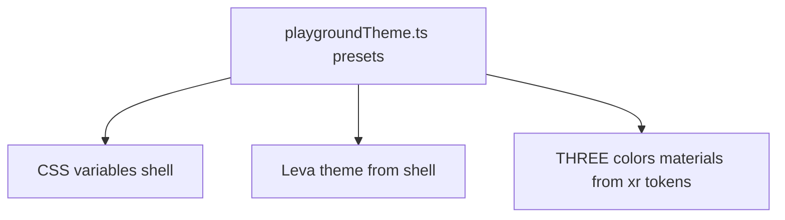
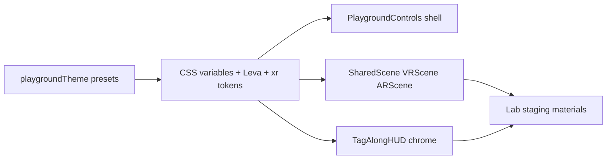

# Spatial polish plan (WebXR performance–aware)

This document captures the agreed direction for elevating visual polish across the XR Interaction Playground: desktop shell, shared VR/AR foundations, in-headset HUD, and per-lab staging. It is optimized for **Quest-class WebXR** (steady frame time, few lights, simple materials).

**Mood, film references, and WebXR craft links** live in the style templates: [Shell — Inspiration](./style-templates/shell-2d.md#inspiration), [XR — Inspiration](./style-templates/xr-3d.md#inspiration).

**Execution readiness:** This plan is **ready to implement** when you treat [shell-2d.md](./style-templates/shell-2d.md) and [xr-3d.md](./style-templates/xr-3d.md) as the numeric/component source of truth and follow the [Execution guide](#execution-guide) below (file manifest, state wiring, acceptance checks).

**Related:** [Overview](./overview.md), [Pitfalls](./pitfalls.md) (Leva, drei `Text`), lab registry in [`src/config/labs.ts`](../src/config/labs.ts). **Visual specs:** [Shell 2D](./style-templates/shell-2d.md), [XR 3D](./style-templates/xr-3d.md), [style templates index](./style-templates/README.md). **Deeper XR set-dressing track (phased):** [xr-scene-enhancement-plan.md](./xr-scene-enhancement-plan.md).

---

## Code map

Files that typically change for this effort:

[`src/app/LabContent.tsx`](../src/app/LabContent.tsx), [`src/ui/PlaygroundControls.tsx`](../src/ui/PlaygroundControls.tsx), [`src/ui/DebugPanel.tsx`](../src/ui/DebugPanel.tsx), [`src/xr/scene/SharedScene.tsx`](../src/xr/scene/SharedScene.tsx), [`src/xr/scene/VRScene.tsx`](../src/xr/scene/VRScene.tsx), [`src/xr/scene/ARScene.tsx`](../src/xr/scene/ARScene.tsx), [`src/xr/hud/TagAlongHUD.tsx`](../src/xr/hud/TagAlongHUD.tsx), and lab files under [`src/labs/`](../src/labs/).

**Creative summary:** Shell = soft, intimate control room ([shell-2d](./style-templates/shell-2d.md)); XR = playful institutional future ([xr-3d](./style-templates/xr-3d.md)); performance guardrails = template Principles + [Non-goals](#non-goals-v1) below.

---

## Configurable theming (do this first)

Everything visual should flow from **one typed theme module** so shell and XR stay in sync and presets are swappable without hunting hex codes in components. **Canonical default values and component rules** live in the style template docs: [shell-2d.md](./style-templates/shell-2d.md) and [xr-3d.md](./style-templates/xr-3d.md).

**Proposed structure**

1. **`src/config/playgroundTheme.ts`** (name flexible) exporting:
   - **`shell`:** semantic tokens for the **2D** layer — mirror names and defaults from [shell-2d.md](./style-templates/shell-2d.md), including nested **`shell.space.*`** and **`shell.radius.*`** (see *Theme object shape* in that doc). Colors, fonts, spacing, and radii all live under `shell` for a single CSS-variable pass.
   - **`xr`:** semantic tokens for **Three** usage — mirror [xr-3d.md](./style-templates/xr-3d.md) (environment, lighting, accents, HUD, AR overlay, per-lab routing).
   - **`leva`:** a function **`levaThemeFromShell(shell)`** (or embedded in the same file) that maps shell tokens to Leva’s `theme` object so the tuning panel matches the page.

2. **Apply shell tokens** by setting **CSS variables on `document.documentElement`** (or a wrapper div) in one place—e.g. `src/app/applyPlaygroundTheme.ts` called from [`App.tsx`](../src/app/App.tsx) or a tiny `ThemeRoot` component whenever the active preset changes.

3. **Apply XR tokens** by reading the same preset object in R3F (e.g. `useMemo(() => new Color(xr.floor), [preset])`) in [`SharedScene`](../src/xr/scene/SharedScene.tsx), [`VRScene`](../src/xr/scene/VRScene.tsx), HUD, and shared visual helpers—**no** `getComputedStyle` in the render loop.

4. **User-facing configuration (from day one):**
   - **Presets:** at minimum `default` (Her shell + Fifth/Loki XR) and optionally `highContrast` or a cooler shell variant for accessibility testing—all defined as data in the theme module.
   - **Persistence:** `localStorage` key e.g. `xr-playground-theme` + optional **URL query** `?theme=` for sharing a look with collaborators.
   - **Minimal UI:** a compact **“Theme”** control in the playground shell (preset `<select>` or two chips) so headset testers can switch without editing code.

5. **Documentation:** preset **IDs** are defined in code; suggested pairs with [shell-2d.md](./style-templates/shell-2d.md): `default` = Her-like shell + default XR palette; optional **`shellCool`** = cooler shell variant; optional **`highContrast`** = composite preset (shell + XR tweaks) for accessibility experiments. Keep [Pitfalls](./pitfalls.md) in mind when piping numbers into Leva-driven geometry.

---

## 1) Control interface (desktop + tuning)

**Current:** Bottom-left inline-styled buttons; Leva with width/font tweaks only.

**Proposed:**

- **Playground chrome:** Group **Session** (Enter VR / Enter AR) vs **Experiments** (lab chips). Show **mode badge** per lab (`VR` | `AR` | `cross-xr` from config), one-line **description**, and clear **session active** state.
- **CSS design tokens:** Generated from **`shell`** preset (see [Configurable theming](#configurable-theming-do-this-first)) — surface, border, accent, muted text, radii — shared by playground chrome and the test logger panel.
- **Leva theme:** Built from the same preset via **`levaThemeFromShell`** so the tuning panel matches the *Her*-like page.
- **Later (optional):** Minimal 3D companion panels near TagAlong HUD; avoid heavy `Html` overlays everywhere.

---

## 2) Shared XR foundations

**Lighting** ([`SharedScene.tsx`](../src/xr/scene/SharedScene.tsx)): One key directional + fill; optional low **hemisphere** only if needed. Avoid extra shadow casters.

**VR** ([`VRScene.tsx`](../src/xr/scene/VRScene.tsx)):

- **Fog:** Subtle, floor-matched; Quest-test density.
- **Grid/floor:** Slightly richer section color or very soft floor emissive; still one plane + grid.
- **Skydome:** Low-segment sphere, **unlit** gradient — stops from **`xr.skydome.top` / `horizon` / `bottom`** (see [xr-3d.md](./style-templates/xr-3d.md)).

**AR** ([`ARScene.tsx`](../src/xr/scene/ARScene.tsx)): Passthrough-first; optional thin **alignment ring** or horizon cue, toggleable, additive/low-poly — **`xr.ar.stroke`** and **`xr.ar.opacity`** (same spec).

---

## 3) In-headset HUD

**Current:** Bare `Text` for FPS and logger in [`TagAlongHUD`](../src/xr/hud/TagAlongHUD.tsx).

**Proposed:** One shared **rounded translucent panel** behind stats + log (single shared material). **Loki/TVA** cue: subtle **circular** outer frame or corner “seal” weight; **instrument** text in **mono** from tokens. Colors from **`xr.hud`**. Validate that FPS text updates do not hitch; throttle if needed.

---

## 4) Per-lab staging

| Lab | Staging (low cost) | Interaction polish |
|-----|-------------------|-------------------|
| **Selection** | Pedestals/plinths + soft backdrop arc | Emissive or scale on hover/select (existing scale can stay) |
| **Placement** | Footprint ring + ghost preview with rim read | Colors: idle / valid / invalid |
| **Locomotion** | Chevron or segmented path + distant landmark | Teleport pad edge read; simple colliders |
| **Manipulation** | Shared object silhouette + target gizmo palette | Grab highlight lerp, avoid busy continuous shaders |

**Implementation:** Small `src/xr/visual/` (or similar) that imports **`xr`** tokens from the theme preset (not hardcoded hex), plus shared materials and reused geometries.

**Detailed phased rollout** (staging → environment → materials → optional glTF/textures/shaders, with performance gates): [xr-scene-enhancement-plan.md](./xr-scene-enhancement-plan.md).

---

## 5) Validation

- Quest: run each lab with [`InXRStats`](../src/xr/hud/InXRStats.tsx) while toggling fog/skydome/HUD.
- AR: check contrast on real passthrough; avoid large translucent sheets.
- Before Leva/`Text` changes: [Pitfalls](./pitfalls.md).

---

## Execution guide

### Spec authority

| Layer | Canonical doc | Code must |
|-------|----------------|-----------|
| 2D colors, type, **spacing grid** (`micro` + 4px multiples, `shell.space.xxl`, etc.) | [shell-2d.md](./style-templates/shell-2d.md) | Mirror tokens in `shell`; emit `--pg-shell-*` CSS variables |
| 3D environment, lights, HUD, accents, lab routing | [xr-3d.md](./style-templates/xr-3d.md) | Mirror tokens in `xr`; use `THREE.Color` from preset in R3F |

### Files to add

| Path | Responsibility |
|------|----------------|
| [`src/config/playgroundTheme.ts`](../src/config/playgroundTheme.ts) (new) | Preset records: `id`, `shell`, `xr`; export `playgroundPresets`, `getPlaygroundPreset(id)`, `defaultPlaygroundPresetId`, `levaThemeFromShell(shell)` |
| [`src/app/applyShellTheme.ts`](../src/app/applyShellTheme.ts) (new) | `applyShellTheme(shell: ShellTokens): void` — writes `--pg-shell-*` on `document.documentElement` |
| [`src/xr/theme/PlaygroundThemeContext.tsx`](../src/xr/theme/PlaygroundThemeContext.tsx) (new) | React context providing active **full preset** (or `xr` + `presetId`) for R3F; `usePlaygroundTheme()` hook |

Naming is flexible (`applyShellTheme` vs `applyPlaygroundTheme`) as long as there is **one** writer for CSS variables and **one** context for XR.

### Files to modify

| Path | Change |
|------|--------|
| [`src/app/store.ts`](../src/app/store.ts) | Add `themePresetId: string`, `setThemePresetId`; optional hydration helper — keep theme next to `currentLab` |
| [`src/app/App.tsx`](../src/app/App.tsx) | On preset change: `applyShellTheme(preset.shell)`; wrap Canvas / XR tree with `PlaygroundThemeProvider` keyed by `themePresetId` |
| [`src/main.tsx`](../src/main.tsx) | On startup: read `URLSearchParams` `theme` then `localStorage` key **`xr-playground-theme`**; if valid preset id, seed store before render (or single effect in App) |
| [`src/ui/DebugPanel.tsx`](../src/ui/DebugPanel.tsx) | Pass `theme={levaThemeFromShell(preset.shell)}` (and existing sizes) to `<Leva />` |
| [`src/ui/PlaygroundControls.tsx`](../src/ui/PlaygroundControls.tsx) | Layout + session/experiments groups; styles via CSS variables; theme preset `<select>` or chips; lab **mode** badge + description from [`labs`](../src/config/labs.ts) + `currentLab` |
| [`src/ui/TestLoggerPanel.tsx`](../src/ui/TestLoggerPanel.tsx) | Same shell variables / typography as playground chrome |
| [`src/xr/scene/SharedScene.tsx`](../src/xr/scene/SharedScene.tsx), [`VRScene.tsx`](../src/xr/scene/VRScene.tsx), [`ARScene.tsx`](../src/xr/scene/ARScene.tsx) | Consume `xr` from theme context; fog, skydome, grid, floor, optional AR ring |
| [`src/xr/hud/InXRStats.tsx`](../src/xr/hud/InXRStats.tsx), [`InXRLogger.tsx`](../src/xr/hud/InXRLogger.tsx), [`TagAlongHUD`](../src/xr/hud/TagAlongHUD.tsx) subtree | HUD panel mesh + colors from `xr.hud`; throttle stats label updates if Quest hitches |
| Lab files under [`src/labs/`](../src/labs/) | Staging passes; use `xr.accent.*` / per-lab map keyed by [`LabId`](../src/config/labs.ts) |

Optional later: [`src/xr/visual/`](../src/xr/visual/) shared materials/helpers to avoid duplicated `useMemo` patterns.

### Theme persistence (constants)

- **`localStorage` key:** `xr-playground-theme` — value = preset id string (e.g. `default`, `shellCool`).
- **URL query:** `?theme=<presetId>` — applied once on load; optional: updating the picker pushes `history.replaceState` so links are shareable (nice-to-have).
- **Invalid id:** fall back to `defaultPlaygroundPresetId`.

### XR consumption pattern

- **Do not** read CSS custom properties inside `useFrame` or per render for Three materials.
- **Do** pass the active preset (or `xr`) via **React context** from `App` / `XRRoot` so `SharedScene`, `VRScene`, labs, and HUD call `usePlaygroundTheme()` and `useMemo` colors/materials when `presetId` changes.
- On preset switch, **dispose** or **update** reusable materials in `useEffect` to avoid leaks and stale colors.

### Phase acceptance (definition of done)

| Phase | Scope | Done when |
|-------|--------|-----------|
| **A — Theme core** | `playgroundTheme.ts`, `applyShellTheme`, context, store + persistence + URL | Switching preset updates CSS vars, Leva chrome, and XR scene colors without reload; no new per-frame allocations from theming |
| **B — Shell UI** | `PlaygroundControls`, `TestLoggerPanel` | Session vs experiments layout; mode badges (`labs[].mode` → `VR` / `AR` / `cross-xr`); description line; spacing uses [shell spacing grid](./style-templates/shell-2d.md#spacing--layout) |
| **C — VR foundation** | `SharedScene`, `VRScene` | Fog + skydome + grid/floor match `xr` spec defaults; Quest spot-check stable FPS |
| **D — HUD** | TagAlong subtree | Panel + seal/circular cue; metric color from `xr.hud.textMetric` |
| **E — AR + labs** | `ARScene` overlay; four labs | Optional ring uses `xr.ar.*`; staging uses accent routing table from [xr-3d.md](./style-templates/xr-3d.md) |

### Non-goals (v1)

- No **post-processing** stack (bloom, SSAO) on Quest by default.
- No **heavy `Html`** from drei for full shell parity inside XR.
- No new **glTF asset pipeline** unless a lab explicitly needs it; prefer primitives + tokens.

### Pitfalls (mandatory read before touch)

- [Leva: custom plugins, numeric defaults](./pitfalls.md) — especially geometry driven by Leva.
- [drei `Text` not inside `mesh`](./pitfalls.md).
- Stats: if `setState` in `useFrame` causes jank, throttle or use refs for numeric display.

---

## Implementation order

1. **Phase A** — `playgroundTheme.ts`, `applyShellTheme`, `PlaygroundThemeContext`, store + `localStorage` + `?theme=`  
2. **Phase B** — `PlaygroundControls` + `TestLoggerPanel` (*Her*-like) using `--pg-shell-*`  
3. **Phase C** — `SharedScene` / `VRScene` (*Fifth Element* mood) from context `xr`  
4. **Phase D** — TagAlong HUD panel + instrument styling (`xr.hud`)  
5. **Phase E** — `ARScene` optional overlay; lab staging (**Selection** + **Locomotion** first, then **Placement** + **Manipulation**) via `Record<LabId, …>` + [xr-3d per-lab table](./style-templates/xr-3d.md)  

This order matches the [phase acceptance](#phase-acceptance-definition-of-done) table (phases **A–E**).

---

## Tracking checklist

Use this list when implementing; status is manual (not synced to Cursor plans). Align completed rows with [phases](#phase-acceptance-definition-of-done).

- [ ] **A** `src/config/playgroundTheme.ts` — `shell`, `xr`, presets, `levaThemeFromShell`, `getPlaygroundPreset`, `defaultPlaygroundPresetId`  
- [ ] **A** `src/app/applyShellTheme.ts` — writes `--pg-shell-*` from [shell-2d.md](./style-templates/shell-2d.md)  
- [ ] **A** `src/xr/theme/PlaygroundThemeContext.tsx` + provider from `App.tsx` / XR tree  
- [ ] **A** `src/app/store.ts` — `themePresetId` + setter; hydrate from `?theme=` + `localStorage` key **`xr-playground-theme`** in `main.tsx` or `App`  
- [ ] **A** `DebugPanel.tsx` — Leva `theme` from `levaThemeFromShell(preset.shell)`  
- [ ] **B** `PlaygroundControls.tsx` — groups, badges from `labs[].mode`, description, theme picker  
- [ ] **B** `TestLoggerPanel.tsx` — shell CSS variables / spacing grid  
- [ ] **C** `SharedScene.tsx` / `VRScene.tsx` — `xr` lights, fog, skydome, grid, floor  
- [ ] **E** `ARScene.tsx` — optional overlay + toggle (`xr.ar.stroke` / `xr.ar.opacity`)  
- [ ] **D** `TagAlongHUD` / `InXRStats` / `InXRLogger` — panel chrome, throttle stats if needed  
- [ ] **E** Lab staging: Selection, Locomotion, Placement, Manipulation — `Record<LabId, …>` accents per [xr-3d.md](./style-templates/xr-3d.md)  
- [ ] **E** Optional `src/xr/visual/` helpers (shared materials, no scattered hex)  
- [ ] Quest validation + preset switch smoke test; PR / commit mentions any perf notes  
