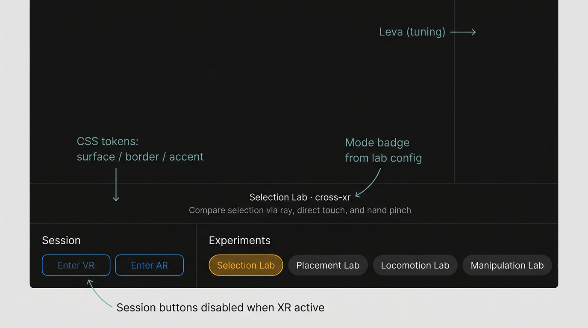
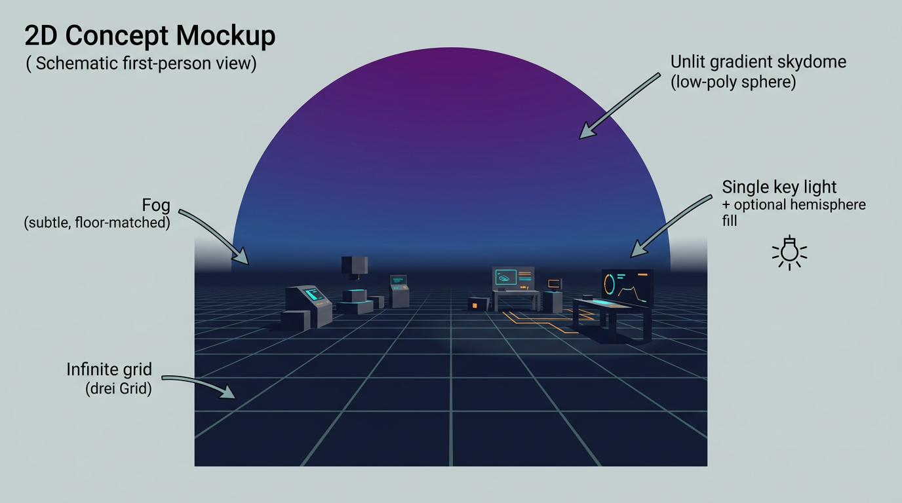
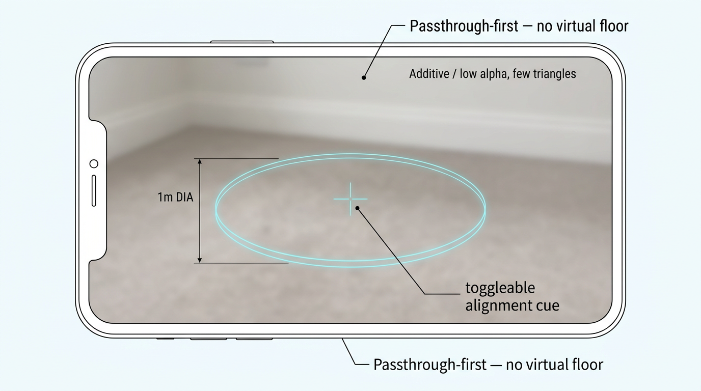
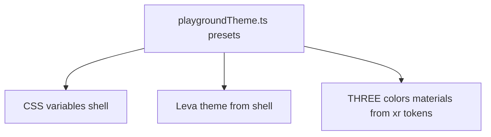
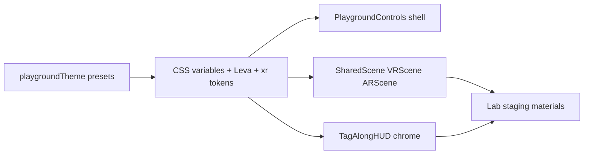

# Spatial polish plan (WebXR performance–aware)

This document captures the agreed direction for elevating visual polish across the XR Interaction Playground: desktop shell, shared VR/AR foundations, in-headset HUD, and per-lab staging. It is optimized for **Quest-class WebXR** (steady frame time, few lights, simple materials).

**Theme note:** Fictional references below are **mood and composition guides only** (palette, typography, shape language)—not likenesses or franchise assets.

**2D review mockups** (annotated concept frames) live in [`docs/mockups/spatial-polish/`](./mockups/spatial-polish/README.md). Those frames predate the **Her / Fifth Element / Loki** direction; replace or regenerate mockups once the theme config and presets are settled.

**Related:** [Overview](./overview.md), [Pitfalls](./pitfalls.md) (Leva, drei `Text`), lab registry in [`src/config/labs.ts`](../src/config/labs.ts). **Style specs:** [Shell 2D](./style-templates/shell-2d.md), [XR 3D](./style-templates/xr-3d.md), [templates index](./style-templates/README.md).

### Mockup gallery

---

## Inspiration (web + industry patterns)

- [Meta WebXR performance best practices](https://developers.meta.com/horizon/documentation/web/webxr-perf-bp/) — reduce overdraw, avoid per-frame allocations/GC hot paths, validate on device.
- [MDN WebXR performance guide](https://developer.mozilla.org/en-US/docs/Web/API/WebXR_Device_API/Performance) — balance quality, depth precision, materials, and scene complexity vs frame rate.
- **Spatial UI** — hierarchy uses depth, reach, and motion; avoid flat 2D UI pasted into 3D without comfortable placement and clear states.
- [Mozilla Hello WebXR — visual development](https://blog.mozvr.com/visualdev-hello-webxr/) — readable **simple materials**, **limited textures**, **art-directed color** over heavy shader stacks.

## Inspiration (film / TV — creative direction)

**Web page + configuration UI (Leva, controls, logger): *Her*-like**

- Warm, quiet, **human** interface: paper-adjacent off-whites and dusty rose / peach / soft coral accents (not loud product red).
- **Lots of breathing room**, soft radii, low-contrast dividers, **humanist sans** for labels; interactions feel calm and legible, not “gamer HUD.”
- Buttons and chips: subtle elevation or hairline border—not heavy chrome.

**XR environments + in-world chrome: *The Fifth Element* + *Loki* (TVA)**

- **Fifth Element energy:** dense future-city **vertical rhythm** as *layout* inspiration—stacked bands, strong **orange / amber / cyan** accents, **neon rim reads** on interactive props, playful legibility at a glance (still low-poly and cheap materials).
- **Loki / TVA discipline:** **institutional** mustard, tan stone, and deep brown-red; **circular seal / stamp** motifs for HUD frames and mode badges; **monospace or narrow** type for “instrument” lines (FPS, logs); **brutalist** slabs and corridors translated into simple boxes and arches in the lab stages.

**Code touchpoints:** [`src/app/LabContent.tsx`](../src/app/LabContent.tsx), [`src/ui/PlaygroundControls.tsx`](../src/ui/PlaygroundControls.tsx), [`src/ui/DebugPanel.tsx`](../src/ui/DebugPanel.tsx), [`src/xr/scene/SharedScene.tsx`](../src/xr/scene/SharedScene.tsx), [`src/xr/scene/VRScene.tsx`](../src/xr/scene/VRScene.tsx), [`src/xr/scene/ARScene.tsx`](../src/xr/scene/ARScene.tsx), [`src/xr/hud/TagAlongHUD.tsx`](../src/xr/hud/TagAlongHUD.tsx), and lab files under [`src/labs/`](../src/labs/).

---

## Configurable theming (do this first)

Everything visual should flow from **one typed theme module** so shell and XR stay in sync and presets are swappable without hunting hex codes in components. **Canonical default values and component rules** live in the style template docs: [shell-2d.md](./style-templates/shell-2d.md) and [xr-3d.md](./style-templates/xr-3d.md).

**Proposed structure**

1. **`src/config/playgroundTheme.ts`** (name flexible) exporting:
   - **`shell`:** semantic tokens for the **2D** layer — mirror names and defaults from [shell-2d.md](./style-templates/shell-2d.md), including nested **`shell.space.*`** and **`shell.radius.*`** (see *Theme object shape* in that doc). Colors, fonts, spacing, and radii all live under `shell` for a single CSS-variable pass.
   - **`xr`:** semantic tokens for **Three** usage — mirror [xr-3d.md](./style-templates/xr-3d.md) (environment, lighting, accents, HUD, AR overlay, per-lab routing).
   - **`leva`:** a function **`levaThemeFromShell(shell)`** (or embedded in the same file) that maps shell tokens to Leva’s `theme` object so the tuning panel matches the page.

2. **Apply shell tokens** by setting **CSS variables on `document.documentElement`** (or a wrapper div) in one place—e.g. `src/app/applyPlaygroundTheme.ts` called from [`App.tsx`](../src/app/App.tsx) or a tiny `ThemeRoot` component whenever the active preset changes.

3. **Apply XR tokens** by reading the same preset object in R3F (e.g. `useMemo(() => new Color(xr.floor), [preset])`) in [`SharedScene`](../src/xr/scene/SharedScene.tsx), [`VRScene`](../src/xr/scene/VRScene.tsx), HUD, and shared visual helpers—**no** `getComputedStyle` in the render loop.

4. **User-facing configuration (from day one):**
   - **Presets:** at minimum `default` (Her shell + Fifth/Loki XR) and optionally `highContrast` or a cooler shell variant for accessibility testing—all defined as data in the theme module.
   - **Persistence:** `localStorage` key e.g. `xr-playground-theme` + optional **URL query** `?theme=` for sharing a look with collaborators.
   - **Minimal UI:** a compact **“Theme”** control in the playground shell (preset `<select>` or two chips) so headset testers can switch without editing code.

5. **Documentation:** preset **IDs** are defined in code; suggested pairs with [shell-2d.md](./style-templates/shell-2d.md): `default` = Her-like shell + default XR palette; optional **`shellCool`** = cooler shell variant; optional **`highContrast`** = composite preset (shell + XR tweaks) for accessibility experiments. Keep [Pitfalls](./pitfalls.md) in mind when piping numbers into Leva-driven geometry.

---

## Design direction

**Shell thesis (*Her*):** *Soft, intimate control room* — warm neutrals, coral/peach accent, calm typography, configuration UI feels like correspondence, not a cockpit.

**XR thesis (*Fifth Element* + *Loki*):** *Playful institutional future* — bold but readable accents, circular HUD frames, vertical staging bands, monospace instrument lines; still **one skydome, one grid, few lights**.

**Performance thesis:** *Cheap materials, few lights, shared meshes/materials, motion only where it teaches* — no default post-processing on Quest; cap curve segments; limit `Text` instances; reuse geometries via shared helpers. Theme switching must **not** allocate new objects every frame—apply preset changes in `useEffect` or on store update, reuse materials where possible.

---

## 1) Control interface (desktop + tuning)

**Current:** Bottom-left inline-styled buttons; Leva with width/font tweaks only.

**Proposed:**

- **Playground chrome:** Group **Session** (Enter VR / Enter AR) vs **Experiments** (lab chips). Show **mode badge** per lab (`VR` | `AR` | `cross-xr` from config), one-line **description**, and clear **session active** state.
- **CSS design tokens:** Generated from **`shell`** preset (see [Configurable theming](#configurable-theming-do-this-first)) — surface, border, accent, muted text, radii — shared by playground chrome and the test logger panel.
- **Leva theme:** Built from the same preset via **`levaThemeFromShell`** so the tuning panel matches the *Her*-like page.
- **Later (optional):** Minimal 3D companion panels near TagAlong HUD; avoid heavy `Html` overlays everywhere.

**Mockup:** [`mockups/spatial-polish/01-desktop-playground-shell.png`](./mockups/spatial-polish/01-desktop-playground-shell.png)

---

## 2) Shared XR foundations

**Lighting** ([`SharedScene.tsx`](../src/xr/scene/SharedScene.tsx)): One key directional + fill; optional low **hemisphere** only if needed. Avoid extra shadow casters.

**VR** ([`VRScene.tsx`](../src/xr/scene/VRScene.tsx)):

- **Fog:** Subtle, floor-matched; Quest-test density.
- **Grid/floor:** Slightly richer section color or very soft floor emissive; still one plane + grid.
- **Skydome:** Low-segment sphere, **unlit** gradient — stops from **`xr.skydome.top` / `horizon` / `bottom`** (see [xr-3d.md](./style-templates/xr-3d.md)).

**AR** ([`ARScene.tsx`](../src/xr/scene/ARScene.tsx)): Passthrough-first; optional thin **alignment ring** or horizon cue, toggleable, additive/low-poly — **`xr.ar.stroke`** and **`xr.ar.opacity`** (same spec).

**Mockup:** [`mockups/spatial-polish/02-vr-environment-atmosphere.png`](./mockups/spatial-polish/02-vr-environment-atmosphere.png), [`mockups/spatial-polish/03-ar-alignment-overlay.png`](./mockups/spatial-polish/03-ar-alignment-overlay.png)

---

## 3) In-headset HUD

**Current:** Bare `Text` for FPS and logger in [`TagAlongHUD`](../src/xr/hud/TagAlongHUD.tsx).

**Proposed:** One shared **rounded translucent panel** behind stats + log (single shared material). **Loki/TVA** cue: subtle **circular** outer frame or corner “seal” weight; **instrument** text in **mono** from tokens. Colors from **`xr.hud`**. Validate that FPS text updates do not hitch; throttle if needed.

**Mockup:** [`mockups/spatial-polish/04-in-xr-hud-panel.png`](./mockups/spatial-polish/04-in-xr-hud-panel.png)

---

## 4) Per-lab staging

| Lab | Staging (low cost) | Interaction polish |
|-----|-------------------|-------------------|
| **Selection** | Pedestals/plinths + soft backdrop arc | Emissive or scale on hover/select (existing scale can stay) |
| **Placement** | Footprint ring + ghost preview with rim read | Colors: idle / valid / invalid |
| **Locomotion** | Chevron or segmented path + distant landmark | Teleport pad edge read; simple colliders |
| **Manipulation** | Shared object silhouette + target gizmo palette | Grab highlight lerp, avoid busy continuous shaders |

**Implementation:** Small `src/xr/visual/` (or similar) that imports **`xr`** tokens from the theme preset (not hardcoded hex), plus shared materials and reused geometries.

**Mockup:** [`mockups/spatial-polish/05-lab-stages-overview.png`](./mockups/spatial-polish/05-lab-stages-overview.png)

---

## 5) Validation

- Quest: run each lab with [`InXRStats`](../src/xr/hud/InXRStats.tsx) while toggling fog/skydome/HUD.
- AR: check contrast on real passthrough; avoid large translucent sheets.
- Before Leva/`Text` changes: [Pitfalls](./pitfalls.md).

---

## Implementation order

1. **`playgroundTheme.ts` + apply to CSS + Leva + THREE** (presets, persistence, small theme picker in shell)  
2. Desktop shell layout (*Her*-like) using shell variables  
3. VR atmosphere (skydome, fog, grid/floor) driven by **`xr`** tokens (*Fifth Element* mood)  
4. HUD panel chrome (*Loki* circular / institutional cues)  
5. Lab stages (Selection + Locomotion first, then Placement + Manipulation) consuming **`xr.accent.*`** per lab routing in [xr-3d.md](./style-templates/xr-3d.md) (Per-lab accent routing table; implement as `Record<LabId, …>` or similar in theme code)  
6. Regenerate or replace mockups under `docs/mockups/spatial-polish/` to match the new palette

---

## Tracking checklist

Use this list when implementing; status is manual (not synced to Cursor plans).

- [ ] `src/config/playgroundTheme.ts` — `shell`, `xr`, presets, `levaThemeFromShell`  
- [ ] Apply shell → CSS variables; wire `DebugPanel` / Leva to preset  
- [ ] Theme picker + `localStorage` + optional `?theme=` query  
- [ ] `PlaygroundControls` layout and lab metadata (*Her*-like)  
- [ ] `SharedScene` / `VRScene`: colors from `xr` (hemisphere optional, fog, skydome, grid/floor)  
- [ ] `ARScene`: optional alignment overlay + toggle (`xr.ar.stroke` / `xr.ar.opacity`)  
- [ ] `TagAlongHUD`: panel + circular / institutional HUD cues (`xr.hud`)  
- [ ] Shared `src/xr/visual/` helpers (read theme, no scattered hex)  
- [ ] Selection / Locomotion / Placement / Manipulation staging passes  
- [ ] Updated mockups in `docs/mockups/spatial-polish/`  
- [ ] Quest validation notes in PR or commit message  
